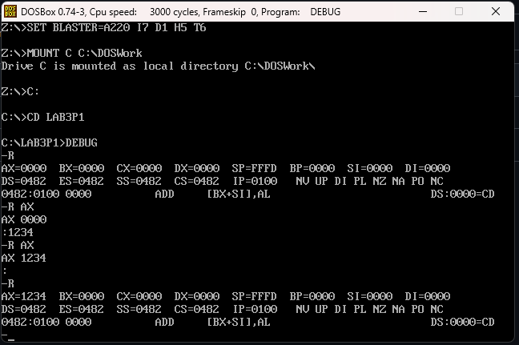
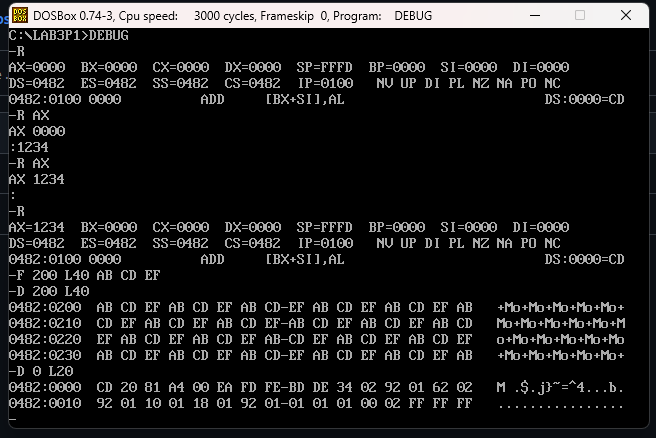
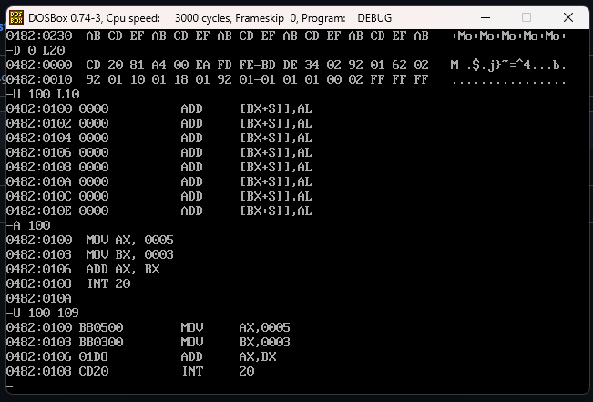

# Quintero-Carrillo-post1-u3
Laboratorio Post-Contenido 1 Unidad 3 - Manejo del DEBUG - Arquitectura de Computadores
 Arquitectura de Computadores  
Unidad: 3 — Manejo del DEBUG  
Estudiante: Neidys Mariana Quintero Carrillo

## Descripción
El presente laboratorio explora los comandos fundamentales del depurador DEBUG
dentro del entorno DOSBox. Se configuró el entorno, se inspeccionaron registros,
se manipuló memoria y se ensamblaron instrucciones directamente en memoria.

 ## Checkpoint 1 — Estado de Registros (comando R)

**Observaciones:**
- AX, BX, CX y DX presentaron valor 0x0000 en el estado inicial.
- Los cuatro registros de segmento (DS, ES, SS, CS) apuntaban al mismo valor,
  correspondiente al párrafo de memoria del PSP asignado por el DOS.
- IP = 0x0100 indica la primera dirección ejecutable tras el PSP.
- SP = 0xFFFE corresponde al tope inicial de la pila del segmento.
- La instrucción señalada por CS:IP era `CD20` (INT 20), instrucción de
  terminación del programa.

  ## Checkpoint 2 — Volcado Hexadecimal (comandos F y D)

**Descripción de las columnas del comando D:**
La salida del comando D contiene tres columnas. La primera indica la dirección
lógica en formato segmento:offset donde comienza la fila. La segunda columna
muestra los 16 bytes de esa fila en hexadecimal, agrupados en dos bloques de
8 separados por un guion. La tercera columna presenta la representación ASCII
de esos mismos bytes, sustituyendo con un punto los valores fuera del rango
imprimible (0x20–0x7E).

**Observaciones:**
- El patrón AB CD EF se repitió cíclicamente en los 64 bytes rellenos (0x40).
- Los valores 0xAB, 0xCD y 0xEF no tienen representación ASCII imprimible,
  por lo que la columna derecha muestra únicamente puntos.
- Los primeros 2 bytes del PSP (CD 20) corresponden a la instrucción INT 20,
  mecanismo de terminación de emergencia del DOS.

  ## Checkpoint 3 — Ensamblado y Desensamblado (comandos A y U)

**Observaciones:**
- `MOV AX,0005` se codifica como `B8 05 00` (opcode B8 + inmediato en little-endian).
- `MOV BX,0003` se codifica como `BB 03 00`.
- `ADD AX,BX` se codifica como `03 C3` (2 bytes).
- `INT 20` se codifica como `CD 20`.
- El programa completo ocupa 10 bytes a partir de CS:0100.

## Conclusiones
El laboratorio permitió comprender cómo el depurador DEBUG expone directamente
el estado interno del procesador x86. Se verificó que en modo real no existe
distinción hardware entre código y datos, y que el procesador interpreta como
instrucción cualquier byte al que apunte CS:IP. El formato little-endian resultó
evidente al comparar los operandos inmediatos en el volcado hexadecimal con
las instrucciones desensambladas.
